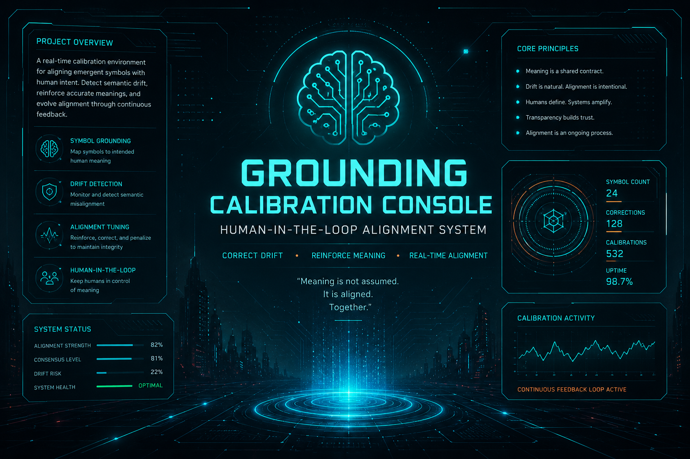

## 🧬 CORE OVERVIEW

A browser-based cybernetic simulation console for exploring:

 - Symbol grounding systems
 - Alignment drift behavior
 - Human-in-the-loop feedback control
 - Semantic stability scoring

This is not an AI model.

It is a synthetic alignment simulation environment designed to visually and interactively mimic conceptual AI training dynamics.

## 🧪 WHAT THIS IS
##✔ A visual + interactive simulation of:

 - Symbol grounding concepts
 - Alignment stability systems
 - Feedback-based correction loops
 - Drift and entropy modeling

## ❌ WHAT THIS IS NOT

 - Not a machine learning model
 - Not training neural networks
 - Not using embeddings or real AI memory
 - Not connected to external AI systems

## ⚙️ FEATURES

 - Symbol inventory system
 - Alignment strength visualization
 - Drift correction mechanics
 - Interactive calibration logg

## ⚡ Real-time simulation feedback

## 🧬 PURPOSE
This project is designed as a conceptual experimentation layer for:

 - AI alignment visualization
 - Human-machine semantic feedback systems
 - Symbolic cognition simulation
 - Drift behavior modeling

## 🛰️ ARCHITECTURE (SIMPLIFIED)
User Input   ↓Symbol Engine   ↓Alignment Model   ↓Drift Simulation Layer   ↓Feedback Controller   ↓System State Update

## 🔒 DESIGN PHILOSOPHY
“Meaning is not stored — it is continuously stabilized.”

This system explores the idea that:
 - meaning is dynamic
 - alignment is fragile
 - correction is continuous

## ⚡ STATUS
Simulation Mode Active
Drift: Controlled
Alignment: Semi-stable
Feedback Loop: Online
Console: Operational

### 🧠⚡ Grounding Calibration Console

A browser-based simulation UI for exploring symbolic alignment, drift correction, and human-in-the-loop semantic tuning.

Features

 - Symbol inventory system
 - Alignment strength simulation
 - Drift correction mechanics
 - Interactive calibration logging
 - Cyberpunk-style UI dashboard

## What this project is:

 - The page is a mock “AI alignment / symbol calibration console”.
 - It pretends you are managing abstract “symbols” (SYM-0, SYM-1, etc.) and adjusting their meaning and “alignment strength.”
 - Nothing here is real AI training—it’s a front-end simulation UI.

## 🖥️ HUD INTERFACE MODULES
🔷 SYMBOL REGISTRY PANEL
 - Dynamic symbol generation (SYM-0 → SYM-N)
 - Visual encoding of abstract representations
 - Assignable semantic weights

## What this is “conceptually” Even though it looks AI-related, it is actually:

✔ A simulation of:

Symbol grounding
 - Alignment scoring
 - Drift correction
 - Human feedback loop

❌ But NOT:

 - Real machine learning
 - Real model training
 - Real embeddings or AI memory

## Purpose
This is a conceptual UI prototype for experimenting with:
- semantic alignment systems
- symbolic representation drift
- human feedback loops

🟢 SYSTEM BOOT SEQUENCE
INITIALIZING CALIBRATION CONSOLE...
LOADING SYMBOL REGISTRY... ██████████ 100%
ESTABLISHING HUMAN FEEDBACK LOOP...
ALIGNMENT ENGINE: ONLINE
DRIFT MODEL: ACTIVE
STATUS: STABLE (SIMULATION MODE)
🧬 CORE OVERVIEW

A browser-based cybernetic simulation console for exploring:

Symbol grounding systems
Alignment drift behavior
Human-in-the-loop feedback control
Semantic stability scoring

This is not an AI model.

It is a synthetic alignment simulation environment designed to visually and interactively mimic conceptual AI training dynamics.

🖥️ HUD INTERFACE MODULES
🔷 SYMBOL REGISTRY PANEL
Dynamic symbol generation (SYM-0 → SYM-N)
Visual encoding of abstract representations
Assignable semantic weights
🔶 ALIGNMENT ENGINE
Real-time alignment strength visualization
Stability scoring system
Feedback-driven recalibration loop
🔴 DRIFT DETECTION SYSTEM
Tracks divergence of symbolic meaning over time
Simulates semantic decay
Triggers corrective calibration events
🟣 HUMAN FEEDBACK LOOP
User-driven correction inputs
Reinforcement-based adjustment simulation
Logs interaction history as “alignment memory”
📡 SYSTEM BEHAVIOR MODEL

The console simulates three interacting systems:

Symbol generation layer
Drift + instability dynamics
Human correction feedback loop

Together they form a closed-loop symbolic alignment simulator.
